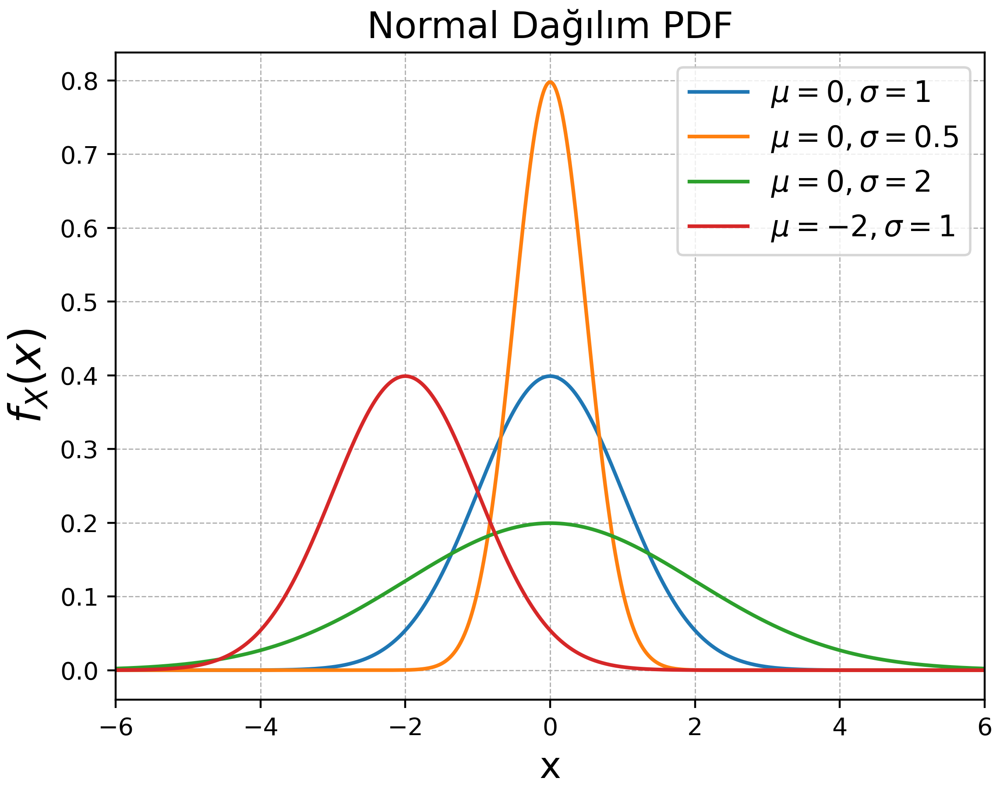

<h2>EEM 217 Olasılık Kuramı</h2>

<h3>Normal Dağılım</h3>

Normal dağılım olasılık yoğunluk fonksiyonu (probability distribution function - pdf) aşağıdaki formdadır.

$$
f_X(x) = \frac{1}{\sqrt{2\pi\sigma^2}}
e^{\displaystyle \frac{(x-\mu)^2}{2\sigma^2}}
$$

Normal dağılım pdf parametreleri olan ortalama (mean) $\mu$ ve standard sapma (standard deviation) $\sigma$ fonksiyonunu belirlemektedir. Anlamak için aşağıdaki şekili inceleyiniz.

Normal dağılımın modellediği bir olasılık sorusunda ihtimal hesabı yapmak gerçekten zor ve zahmetlidir. Hiç kimse bu pdf'in integralini alıp olasılık hesaplamak istemez. Bu noktada hem normal dağılımın standardize edilmesi hem de kümülatif dağılım fonksiyonu (cumulative distribution function - cdf) kullanımı işimizi kolaylaştıracak.

<h4>Standard Normal Dağılım</h4>

Yukarıda $X$ rasgele değişkeninin $mu$ ve $sigma$ parametrelerine sahip bir normal dağılımla modellendiğini belirtelim.

$$\displaystyle X\sim N(\mu ,\sigma ^{2})$$

Burada $X$ değişkeninden ortalamayı çıkarıp standart sapmaya bölerek standartlaştırmayı gerçekleştirelim.

$$\displaystyle \frac{X-\mu}{\sigma} = Z \sim N(0, 1)$$

Karşılaştığımız sorularda bu standart hâle dönüştürüp normal dağılım <b>cdf</b> tablosundaki değerleri kullanarak soruyu çözeceğiz.

<h3>Ders Önhazırlık</h3>

<a href="https://github.com/mtahakoroglu/probability/tree/main/lecture/week_01">Hafta 1: Permütasyon ve Koşullu/Toplam Olasılığa Giriş (Örneklem Uzay ve Alt Uzaylar Kavramları)</a>

<a href="https://github.com/mtahakoroglu/probability/tree/main/lecture/week_02">Hafta 2: Kombinasyon ve Koşullu/Toplam Olasılık (devam)</a>

<a href="https://github.com/mtahakoroglu/probability/tree/main/lecture/week_03">Hafta 3: Buluşma İhtimali (Matematiksel ve Nümerik Çözüm)</a>

<a href="https://github.com/mtahakoroglu/probability/tree/main/lecture/week_04">Hafta 4: Koşullu/Toplam Olasılık</a>

<a href="https://github.com/mtahakoroglu/probability/tree/main/lecture/week_05">Hafta 5: Histogramlara Giriş, Histogramda (Basit) Koşullu Olasılık</a>

<a href="https://github.com/mtahakoroglu/probability/tree/main/lecture/week_06">Hafta 6: Histogramlar (devam), Dağılımlar ve Rasgele Değişkenlere Giriş, Histogramda Koşullu Olasılık</a>

<a href="https://github.com/mtahakoroglu/probability/tree/main/lecture/week_07">Hafta 7: Üstel (Eksponansiyel) Dağılım Uydurma, Histogramlarda Koşullu/Toplam Olasılık</a>

<a href="https://github.com/mtahakoroglu/probability/tree/main/lecture/week_09_10">Hafta 9-10: Normal (Gaussian) Dağılım Parametreleri ve Tekdüze (Uniform) Dağılım</a>

<a href="C:\Users\mtaha\Dropbox\GitHub\probability\lecture\week_10_11">Hafta 11-12: BAYES</a>

<a href="https://github.com/mtahakoroglu/probability/tree/main/lecture/week_13">Hafta 13: BAYES - devam</a>

<a href="https://github.com/mtahakoroglu/probability/tree/main/lecture/week_14">Hafta 14: Rasgele Sayı Üreteci ile Simülasyon</a>

<a href="https://github.com/mtahakoroglu/probability/tree/main/lecture/week_15">Hafta 15: Öğrenci Yaş Histogram - Python Kodu</a>

<a href="https://github.com/mtahakoroglu/probability/tree/main/lecture/normal-dsitribution">Normal Dağılım</a>

