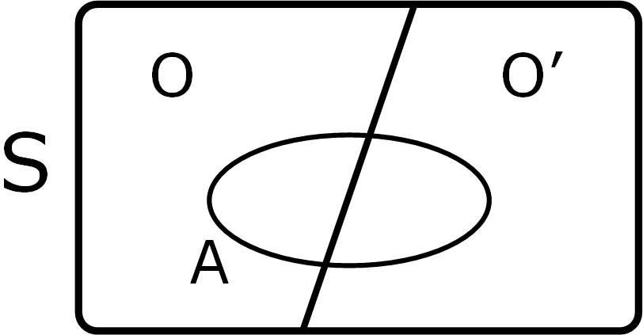
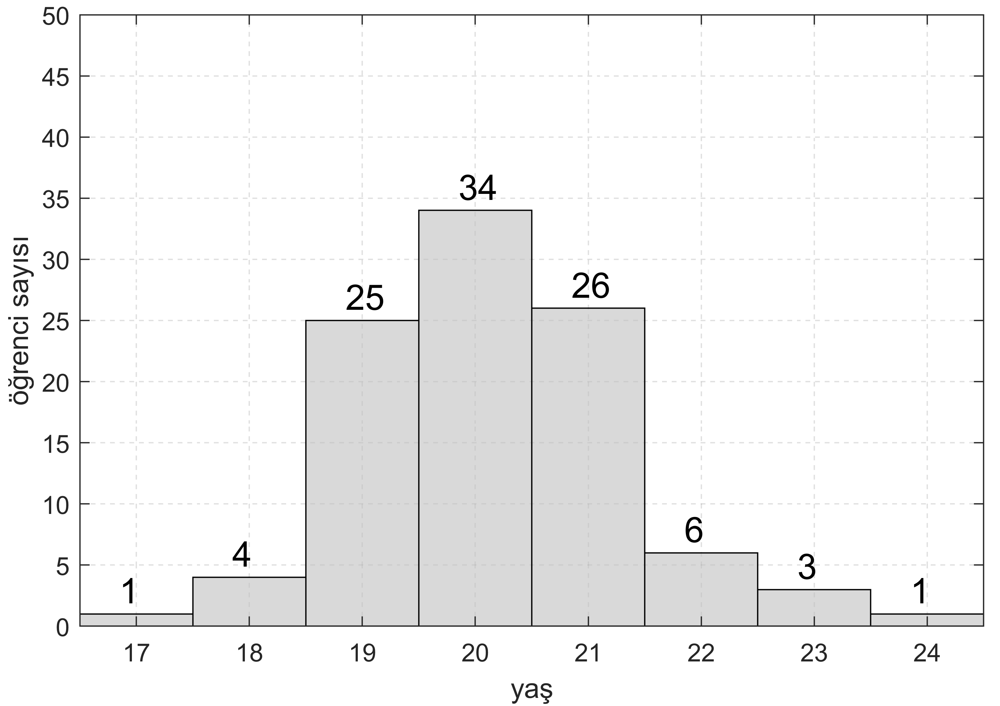

<h2>EEM 217 Olasılık (Probability) Kuramı</h2>
<h3>Hafta 1-2: Permütasyon ve Kombinasyon</h3>
<p align="justify">İlk derslerimizde bugüne kadar ortaokul ve lisede en çok karşımıza çıkan permütasyon ve kombinasyon konularını hatırlayacağız. Yalnız burada karşılaştığımız soruları sadece bu metotlarla değil, aynı zamanda gelecek haftalarda öğreneceğimiz toplam olasılık ve koşullu olasılık kavramlarını kullanarak da çözeceğiz. Bu bize güzel bir başlangıç olacak. Analitik (matematiksel) çözümünü farklı yollardan yaptığımız bu soruları ayrıca bilgisayar ortamında bir programlama diliyle rasgele sayı üreteci (random number generator) kullanarak nümerik olarak da çözüp teorik olarak elde ettiğimiz çözümlerin doğruluklarını test edeceğiz.</p>

<p align="justify"><b>Soru 1:</b> Bir sınıfta altı öğrenci vardır. Öğrencilerden ikisi kızdır. Öğrenciler sınıfın önde yer alan sıralarına yanyana rasgele oturduklarında kız öğrencilerin yanyana gelme olasılığı nedir?</p>

<p align="justify"><b>Çözüm 1:</b> Burada sıraları görselleştirip de "bir sıraya kaç kişi oturabilir" diye düşünerek sayıları tahtaya yazarsak altı öğrencinin sıralara toplam kaç farklı biçimde oturabileceğini hesaplarız. İlk sıraya 6 öğrenci oturabilirken ikinci sıraya doğal olarak 5 kişi oturabilecek ve bu şekilde son sıraya tek öğrenci kalacak biçimde devam edecektir.</p>

| 1. sıra | 2. sıra | 3. sıra | 4. sıra | 5. sıra | 6. sıra |
|  :---:  |  :---:  |  :---:  |  :---:  |  :---:  |  :---:  |
| 6 | 5 | 4 | 3 | 2 | 1 |

<p align="justify">Sıralara yazdığımız bu sayılar çarpım ile bize</p>

$$6 x 5 x 4 x 3 x 2 x 1 = 6!$$

<p align="justify">değerini verir. Bu hesabı Python'da aşağıdaki gibi yapabiliriz. İstersek de ya döngü ile ya da rekürsif (özyinelemeli) bir fonksiyon aracılığıyla faktöriyel hesabını yapabiliriz.</p>

<b>factorial_computation_math.py</b>

```
import math
print(f"6! = {math.factorial(6)}")
```

<b>factorial_computation_numpy.py</b>

```
import numpy as np
print(f"6! = {np.math.factorial(6)}")
```

<p align="justify">Yâni altı öğrenci yanyana 720 farklı biçimde oturabilmektedir. Bizden istenen bu kadar farklı oturma düzeninin hangilerinde iki kız arkadaşın yanyana düştükleri. Burada biraz düşünürsek iki kız arkadaşı tek bir insan gibi kabul edip toplamda 5 kişinin yanyana toplam</p>

$$5!$$

<p align="justify">biçimde oturabileceğini buluruz. A olayını aşağıdaki gibi tanımlayalım.</p>

$$A: \text{İki kızın yanyana gelmesi}$$

<p align="justify">O zaman, iki kızın yanyana gelme olasılığı</p>

$$P(A) = \frac{5!}{6!}$$

<p align="justify">olarak bulunur. Yalnız buraya kadar kurduğumuz mantıkta birşeyi atladık: Kızları tek bir insan gibi düşünüp de $5!$ değerini elde etmemiz mantıklıydı ama kız öğrenciler kendi aralarında yer değiştirebilirler. Bu durumu da gözönünde bulundurmalıyız. İki kız kendi aralarında</p>

$$2!$$

<p align="justify">şekilde oturabilir. Daha önceden elde ettiğimiz çözümü bu durumu da hesaba katarak güncellersek</p>

$$P(A) = \frac{5! 2!}{6!}= \frac{1}{3} = 0.33$$

<p align="justify">olasılığını buluruz.</p>

<p align="justify"><b>Çözüm 2:</b> Şimdi bu soruya başka bir açı olan <b>koşullu olasılık</b> ve <b>toplam olasılık</b> kavramları üzerinden yaklaşalım ve ikinci bir teorik yaklaşımla aynı sonucu elde etmeye çalışalım. Kafamızda durumu canlandıralım diye erkeklere E kızlara K diyerek örnek bir sıralamayı aşağıda görselleştirelim.</p>

| 1. sıra | 2. sıra | 3. sıra | 4. sıra | 5. sıra | 6. sıra |
|  :---:  |  :---:  |  :---:  |  :---:  |  :---:  |  :---:  |
| E | E | K | E | K | E |

<p align="justify">Aynen yukarıdaki sıralama gibi $6!=720$ farklı oturma düzeneği olabileceğini daha önceden bulmuştuk. Şimdi sıralara kimseyi yerleştirmeden önce iki kız arkadaştan birisini alıp ilk önce onu rasgele yerleştirmeyi düşünelim. Zaten rasgele oturmalarda aynı anda herkes farklı bir yere oturamayacak, herkes bir sekans (sequence) hâlinde oturmak zorunda kalacaktır. Bunu biraz düşünürsek anlarız. Boş altı sırayı kafamızda hayal edip iki kız arkadaşdan birini boş yerlerden birine koymayı düşündüğümüzde karşımıza iki durum çıkacaktır. İlk durumda kız arkadaşımızın kenar sıralara değil de orta sıralara oturma ihtimali, ikincisi de bunun tamamlayıcısı (complementary) olan kenardaki sıralara oturma ihtimali. Örneklem uzay $S$ (sample space) diye burada tanıttığımız olasılıklar uzayının bu şekilde ikiye bölünmesinin sebebi, ilk yerleşen kız arkaşımız ortaya oturduğu takdirde her iki yanına da kız arkadaşının gelebilme ihtimali varken, kenara oturduğu zaman sadece bir yanının müsait olması. Mesela aşağıdaki görselde ilk oturan kız arkadaşın 3. sıraya oturduğunu farz edelim. Bu durumda öbür kız geri kalan beş sıradan ikisine oturabilir.</p>

| 1. sıra | 2. sıra | 3. sıra | 4. sıra | 5. sıra | 6. sıra |
|  :---:  |  :---:  |  :---:  |  :---:  |  :---:  |  :---:  |
|  |  | <b>K</b> | K |  |  |

| 1. sıra | 2. sıra | 3. sıra | 4. sıra | 5. sıra | 6. sıra |
|  :---:  |  :---:  |  :---:  |  :---:  |  :---:  |  :---:  |
|  | K | <b>K</b> |  |  |  |

<p align="justify">Bu yanyana oturma ihtimallerini $\frac{2}{5}$ yapar. Öte yandan aşağıdaki örnek sıralamadaki gibi ilk oturan kız kenara oturursa<p>

| 1. sıra | 2. sıra | 3. sıra | 4. sıra | 5. sıra | 6. sıra |
|  :---:  |  :---:  |  :---:  |  :---:  |  :---:  |  :---:  |
|  |  |  |  | K | <b>K</b> |

<p align="justify">o zaman da arkadaşının onun yanına oturma ihtimali $\frac{1}{5}$ olur. Şimdi burada ilk oturan kızın ortaya ve kenara oturma durumlarını olaylar şeklinde tanımlayalım.<p>

$$O: \text{İlk oturan kızın ortaya oturması}$$

$$O': \text{İlk oturan kızın kenara oturması}$$

<p align="justify">Eğer bir üçüncü durum söz konusu olsaydı (önümüzdeki haftalarda böyle ikiden fazla alt uzaya bölünen örnekler yapacağız) onu da hesaba katmalıydık ama burada örneklem uzay ikiye bölünmüş halde. İlgilendiğimiz olay olan "iki kızın yanyana gelmesi" durumunu yukarıda $A$ olarak tanımlamıştık. O zaman örneklem uzayın Venn şeması hâlinde temsili aşağıdaki gibi olur.</p>



<p align="justify">Uzayda koşullu olasılıklara bakmaya başlıyoruz.</p>

$$ A | O: \text{İlk oturan kız ortaya oturduğunda yanyana gelmeleri}$$

$$ A | O': \text{İlk oturan kız kenara oturduğunda yanyana gelmeleri}$$

<p align="justify">Burada ilk önce "ilk kızın ortaya oturması ve o ortaya oturduğunda arkadaşının onun yanına gelmesi ihtimalini" hesap edecek, hemen ardından yaptığımız işlemin örneklem uzayda tamamlayıcısı olan "ilk kızın kenara oturması ve o kenara oturduğunda arkadaşının onun yanına gelmesi" ihtimalini bulacağız. Son olarak elde edilen ihtimalleri toplayıp bütün durumlar için "iki arkadaşın yanyana gelme" olasılığını göreceğiz.</p>

$$P(A) = P(A|O)P(O)+P(A|O')P(O')$$

<p align="justify">İlk oturan kızın sıraların ortasına denk gelmesi ihtimali $P(O) = \frac{4}{6}$ iken tamamlayıcısı olan kenara denk gelme durumu da $P(O) = \frac{2}{6}$ olarak bulunur. $P(A|O)$ ve $P(A|O)$ ifadelerini de yukarıda hesap ettiğimizden, herşeyi yerine koyarsak</p>

$$P(A) = \frac{2}{5}\frac{4}{6}+\frac{1}{5}\frac{2}{6}$$

<p align="justify">olur. Devam edersek yukarıda ilk yolla bulduğumuz değerin aynısını buluruz.</p>

$$P(A) = \frac{1}{3}=0.33$$

<p align="justify"><b>Çözüm 3:</b> Şu ana kadar izlediğimiz yolların hepsi matematiksel çözüm denilen analitik çözümlerdi. Burada bilgisayarlarda yer alan sayıcıları (counter) ve zamanlayıcıları (timer) kullanarak rasgele sayı üreten (random number generation) algoritmalar ile çözümü simüle edeceğiz. Bunu yapmak için istatistikteki <b>büyük sayılar kanunu</b>ndan (the law of large numbers) faydalanacağız. Sonuçta çözümü bir de nümerik olarak bulmaya çalışacağız.</p>

<p align="justify">Aşağıdaki kodları değişik seferlerde koşturduğumuzda kız arkadaşların yanyana denk gelme olasılığının teoride hesaplanan değere yakın olduğunu, özellikle $n$ parametresi olan örnek sayısı (number of samples) değişkenini büyüttükçe kodun her koşturulmasında olasılığın iyice $0.33$'e yaklaştığını görebiliriz.</p>

<h5><b>question1.py</b></h5>

```
import numpy as np

# Parametreler (parameters)
n = 10000  # örnek sayısı (number of samples (trials))
k = 6    # öğrenci sayısı - number of students
students = np.array(['E', 'E', 'E', 'E', 'K', 'K'])  # başlangıç dizilimi
count = 0  # kızlar yanyana geldiği durumları say

for _ in range(n):
    shuffled_students = np.random.permutation(students) # öğrencileri rasgele sırala
    girl_indices = np.where(shuffled_students == 'K')[0] # kız öğrencilerin index'lerini al
    if abs(girl_indices[0] - girl_indices[1]) == 1: # kızlar yanyanaysa sayıcıyı artır
        count += 1

print(f'Toplam {n} örnekle yapılan denemede olasılık {count/n:.3f} bulundu.')
```

<h5><b>question1.m</b></h5>

```
n = 10000; % örnek sayısı (number of samples)
k = 6; % öğrenci sayısı
student = ['E','E','E','E','K','K']; % başlangıç durumu, istenildiği gibi olabilir
count = 0; % kızların yanyana geldiği durumlar
for i=1:n
    girl_index = find(student(randperm(k)) == 'K');
    if abs(girl_index(1)-girl_index(2)) == 1 % yanyana iseler sıra numaraları farkı 1 olmalı
        count = count+1;
    end
end
fprintf('Toplam %i örnekle yapılan denemede olasılık %.3f bulundu.\n', n, count/n);
```

<p align="justify"><b>Soru 2:</b> İki arkadaş sinemaya gidiyorlar. Girdikleri sinema salonu 5 x 10 kapasitelik. Yani 5 sıra var ve her bir sırada 10 koltuk var. Arkadaşlar birbirlerinden habersiz bilet alıyorlar. Koşullu Olasılık ve Toplam Olasılık kavramlarını kullanarak iki arkadaşın filmi yan yana izleme olasılıklarını bulunuz.</p>


<p align="justify"><b>Çözüm 2:</b> Bu sorunun çözümü ikinci hafta derste yapılmıştır. Bu sorunun benzeri sınavlarda (hem ara sınavda hem finalde) karşımıza çıkacaktır.</p>

<p align="justify"><b>Soru 3: (Kombinasyon)</b> Evde meyve olarak Elma, Muz, Portakal, Ananas ve Üzüm var. Gelen misafire meyve ikram edilecek. Ev sahipleri yukarıda sayılan beş çeşit meyveden üç tanesini beraber ikram etmeye karar veriyor.</p>

<ul>
<li>Kaç farklı meyve tabağı hazırlanabilir?</li>
<li>İkram edilen tabaklarda elma ve portakal bulunma olasılığı nedir?</li>
</ul>

<p align="justify">Not: Kombinasyon ile yapamazsanız sayarak yapabilirsiniz. Mesela bütün kombinasyonların bulunduğu küme</p>

<p>S = { EMP, EMA, EMÜ, … }</p>

<p align="justify">şeklinde devam etmektedir. Kendiniz bu kümeyi tamamen oluşturup sonra ilgili kombinasyonları sayarak cevabı bulabilirsiniz.</p>

<p align="justify"><b>Çözüm 3:</b> Beş çeşit meyveden üç tanesini seçmeyi kombinasyon (combination) ile yapacağız.</p>

$$\binom{5}{3} = \frac{5!}{3!(5-3)!}=\frac{5!}{3!2!}=\frac{5x4}{2}=10$$

<p align="justify">Toplam 10 farklı meyve tabağı hazırlanabilir. Bu tabakları aşağıdaki Python koduyla ekrana basarak görebiliriz.</p>

<b>question3.py</b>

```
from itertools import combinations

# Meyve listesini tanımlayalım
fruits = ['Elma', 'Muz', 'Portakal', 'Ananas', 'Üzüm']

# 3'lü bütün kombinasyonları oluşturalım
comb = combinations(fruits, 3)

# Listeye dönüştürüp ekrana basalım
comb_list = list(comb)
for c in comb_list:
    print(c)
```

<ol>
<li>('Elma', 'Muz', 'Portakal')</li>
<li>('Elma', 'Muz', 'Ananas')</li>
<li>('Elma', 'Muz', 'Üzüm')</li>
<li>('Elma', 'Portakal', 'Ananas')</li>
<li>('Elma', 'Portakal', 'Üzüm')</li>
<li>('Elma', 'Ananas', 'Üzüm')</li>
<li>('Muz', 'Portakal', 'Ananas')</li>
<li>('Muz', 'Portakal', 'Üzüm')</li>
<li>('Muz', 'Ananas', 'Üzüm')</li>
<li>('Portakal', 'Ananas', 'Üzüm')</li>
</ol>

<p align=justify>İkram edilen tabaklarda elma ve portakal bulunma olasılığı sorulmuştu. Bu iki meyvenin tabaktaysa o zaman bir meyvelik boş yer var demektir. Buraya da üç meyveden birisi gelebilir.</p>

$$\frac{\binom{3}{1}}{\binom{5}{3}} = \frac{3}{10} = 0.3$$

<p align=justify>Yâni %30 ihtimalle tabaklarda elma ve portakal birlikte yer alırlar. Bu sonucun aynısını yukarıda Python kodunda yazdırdığımız listeden de sayarak bulabiliriz.</p>

<ol>
<li><b>('Elma', 'Muz', 'Portakal') <=== Elma ve Portakal beraber</b></li>
<li>('Elma', 'Muz', 'Ananas')</li>
<li>('Elma', 'Muz', 'Üzüm')</li>
<li><b>('Elma', 'Portakal', 'Ananas') <=== Elma ve Portakal beraber</b></li>
<li><b>('Elma', 'Portakal', 'Üzüm') <=== Elma ve Portakal beraber</b></li>
<li>('Elma', 'Ananas', 'Üzüm')</li>
<li>('Muz', 'Portakal', 'Ananas')</li>
<li>('Muz', 'Portakal', 'Üzüm')</li>
<li>('Muz', 'Ananas', 'Üzüm')</li>
<li>('Portakal', 'Ananas', 'Üzüm')</li>
</ol>

<p align="justify"><b>Soru 4: (Kombinasyon)</b> Bir sepette 15 kahverengi ve 10 beyaz yumurta bulunmaktadır. Aynı anda 5 yumurta seçiliyor. Alınan yumurtalardan 3 tanesinin beyaz olma olasılığını bulunuz.</p>

<p align="justify"><b>Çözüm 4:</b></p>

$$\frac{\binom{15}{2} \binom{10}{3}}{\binom{25}{5}}=\frac{\frac{15!}{13!2!}\frac{10!}{7!3!}}{\frac{25!}{20!5!}}$$

<p align="justify">Burada işlemler uzayacağından dolayı elle hesaplama yerine Python'da <b>math</b> paketinin <b>comb()</b> komutundan faydalanarak bu değeri kolayca bulalım.</p>

```
import math
x = math.comb(15,2)*math.comb(10,3)/math.comb(25,5)
print(f"{x:.3f}")
```

$$\frac{\binom{15}{2} \binom{10}{3}}{\binom{25}{5}} = 0.237$$

<p align="justify"><b>Soru 5: (Koşullu ve Toplam Olasılık)</b> Real Madrid'in genç yıldızı Arda Güler'in bu sezon Real Madrid'den ayrılma ihtimâli %40'tır. Arda takımda kalırsa %30 ihtimalle maçlarda oynayacakken başka bir takıma transfer olması durumunda maçlarda oynama olasılığı %90 olacaktır. Arda'nın bu sezon maçlarda oynama olasılığını koşullu olasılık ve toplam olasılık kullanarak bulunuz.</p>

<p align="justify"><b>Çözüm 5:</b> İlk önce olayları tanımlayalım.</p>

$$ \text{RM: Real Madrid'de kalma}$$

$$ \text{RM': Real Madrid'den ayrılma}$$

$$ \text{O | RM: Real Madrid'de oynama}$$

$$ \text{O | RM': Başka takımda oynama}$$

$$ \text{O: Oynama}$$

<p align="justify">Verilen bilgiler ve tanımlanan olaylar ışığında Arda'nın bu sezon oynama ihtimalini bulalım.</p>

$$P(O) = P(O|\text{RM})P(\text{RM})+P(O|\text{RM'})P(\text{RM'})$$

<p align="justify">Değerleri yerlerine koyarsak</p>

$$P(O) = \frac{30}{100}\frac{60}{100}+\frac{90}{100}\frac{40}{100}$$

<p align="justify">ve sadeleştirme yaparak işlemleri yaparsak</p>

$$P(YL) = \frac{54}{100}=0.54$$

<p align="justify">yâni %54 buluruz.</p>

<p align="justify"><b>Soru 6: (Koşullu ve Toplam Olasılık)</b> Abdurrahman lisans eğitiminden sonra %30 ihtimalle memleketi Çad'a geri dönecek, %50 ihtimalle Türkiye'de kalacak, ya da Avrupa veya Amerika'ya gidecek. Çad'a dönerse yüksek lisans yapma olasılığı %20, Türkiye'de kalırsa %60, Avrupa veya Amerika'ya giderse %30. Bu bilgilere göre Abdurrahman'ın lisans eğitimi sona erdiğinde yüksek lisans yapma ihtimali nedir?</p>

<p align="justify"><b>Çözüm 6:</b> İlk önce olayları tanımlayalım.</p>

$$ \text{Ç: Çad'a gidiyor}$$

$$ \text{T: Türkiye'de kalıyor}$$

$$ \text{A: Avrupa veya Amerika'ya gidiyor}$$

$$ \text{YL | Ç: Çad'a gidince Yüksek Lisans yapıyor}$$

$$ \text{YL | T: Türkiye'de kalınca Yüksek Lisans yapıyor}$$

$$ \text{YL | A: Avrupa veya Almanya'ya gidince Yüksek Lisans yapıyor}$$

$$ \text{YL : Yüksek Lisans yapıyor}$$

<p align="justify">Verilen bilgiler ve tanımlanan olaylar ışığında lisans eğitiminden sonra Abdurrahman'ın yüksek lisans (YL) yapma olasılığını hesaplayalım.</p>

$$P(YL) = P(YL|\text{Ç})P(\text{Ç})+P(YL|\text{T})P(\text{T})+P(YL|\text{A})P(\text{A})$$

<p align="justify">Değerleri yerlerine koyarsak</p>

$$P(YL) = \frac{20}{100}\frac{30}{100}+\frac{60}{100}\frac{50}{100}+\frac{30}{100}\frac{20}{100}$$


<p align="justify">ve sadeleştirme yaparak işlemleri yaparsak</p>

$$P(YL) = \frac{42}{100}=0.42$$

<p align="justify">yâni %42 buluruz.</p>

<p align="justify"><b>Soru 7: (Histogram)</b> Bir sınıftaki öğrencilerin yaşları sayıldığında aşağıda verilen histogram ortaya çıkmıştır. Buna göre sınıfta toplam kaç öğrenci vardır? Aşağıda tanımlanan olaylara göre histogramdaki bilgiler ışığında istenilen olasılıkları bulunuz.</p>



$$ \text{A : Seçilen birinin 21 yaşından büyük olması}$$

$$ \text{B : Seçilen birinin 20 yaşına eşit veya küçük olması}$$

$$ \text{C : Seçilen birinin 20 yaşından küçük veya 21 yaşından büyük olması}$$

$$ \text{D : Seçilen birinin 18 yaşında olması}$$

$$ \text{E : Seçilen birinin 20 yaşından küçük olması}$$

$$ \text{F : Seçilen birinin yaşının çift sayı olması}$$

$$P(A)=?$$
$$P(B)=?$$
$$P(C)=?$$
$$P(D)=?$$
$$P(D|E)=?$$
$$P(E|F')=?$$
$$P(D|F)=?$$

$$P(A)=\frac{6+3+1}{100}=\frac{9}{100}=0.09$$
$$P(B)=\frac{34+25+4+1}{100}=\frac{64}{100}=0.64$$
$$P(C)=\frac{(1+4+25)+(6+3+1)}{100}=\frac{40}{100}=0.4$$
$$P(D)=\frac{4}{100}=0.04$$
$$P(D|E)=\frac{4}{1+4+25}=\frac{2}{15} \approx 0.13$$
$$P(E|F')=\frac{1+4+25}{1+25+26+3}=\frac{30}{55}=\frac{6}{11} \approx 0.55$$
$$P(D|F)=\frac{4}{4+34+6+1}=\frac{4}{45} \approx 0.088$$
