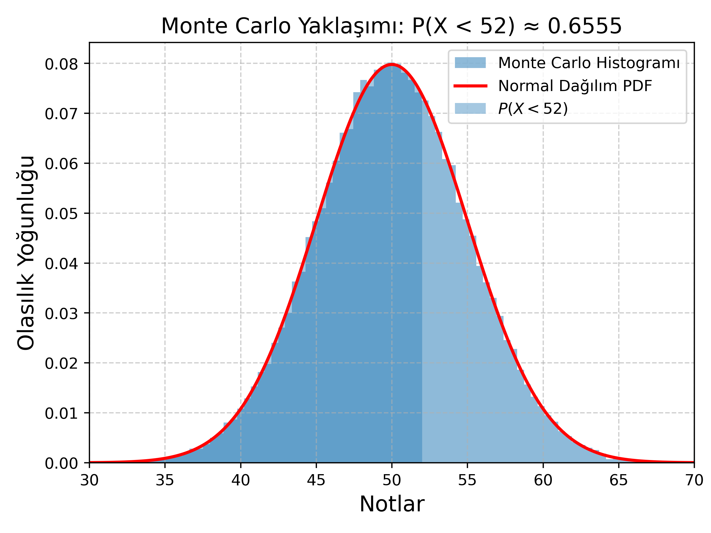

<h2>Normal Dağılım</h2>

Normal dağılımın olasılık yoğunluk fonksiyonu (probability density function – pdf) aşağıdaki şekilde tanımlanır:

$$
f_X(x) = \frac{1}{\sqrt{2\pi\sigma^2}}
e^{\displaystyle \frac{(x-\mu)^2}{2\sigma^2}}
$$

Burada

<ul>
    <li>μ dağılımın ortalamasını (mean),</li>
    <li>σ ise standart sapmasını (standard deviation) ifade eder.</li>
</ul>

Bu iki parametre, normal dağılımın hem konumunu hem de yayılımını tamamen belirler. Aşağıdaki şekilde, farklı parametre değerleri için normal dağılımın tipik görünümü verilmiştir. 📌 Not: Normal dağılım sürekli bir dağılımdır ve olasılıklar, pdf’in belirli aralıklardaki integrali ile hesaplanır.

<b>Soru: </b>Aşağıda bir dağılıma ait normalize edilmiş dört histogram verilmiştir. <i>(a)</i> Bu dağılımın ismi nedir? <i>(b)</i> Bu dağılımın parametreleri nelerdir? İsimlerini ve sembollerini yazıp ne manaya geldiklerini açıklayınız. <i>(c)</i> {a, b, c, d, e, f, g, h} değerlerini {0, 0, 0, 0.2, 0.5, 1, 5, -2} değerleriyle eşleyiniz. <i>(d)</i> Sözüne güvenilir ve güvenilmez iki insan var. <i>(i)</i>, <i>(ii)</i>, <i>(iii)</i> ve <i>(iv)</i>'te gösterilen dağılımlarından hangi ikisi bu insanları modelleyemeye uygundur?

</b><i>(a)</i> Bu dağılımın ismi Normal (Gaussian) dağılımdır. Dağılıma ait pdf aşağıdaki gibidir.

$$f_X(x) = \displaystyle \frac{1}{\sqrt{2\pi\sigma^2}} \displaystyle e^{\displaystyle -\frac{(x - \mu)^2}{2\sigma^2}}$$

<i>(b)</i> Normal dağılımın yatay eksende hareket edebilen merkezine ortalama (mean) denilmekte ve $\mu$ sembolüyle gösterilmektedir. Dağılıma ait ikinci parametre standart sapma (standard deviation) denilen ve $\sigma$ sembolüyle gösterilen parametredir. Bu parametrenin ifade ettiği manaya öbür şıklarda değinilecektir.

<i>(c)</i> Parametrelerin değerleri aşağıdaki gibidir. a=c=e=0 g=-2 b=0.2 h=0.5 d=1 f=5

<i>(d)</i> Sözüne güvenilen kişi <i>(i)</i> ile modellenebilir. Güvenilmez olan ise <i>(iii)</i> ile modellenmeye daha uygundur.

---

Normal dağılımın modellediği problemlerde doğrudan integral alarak olasılık hesaplamak genellikle zahmetlidir. Bu nedenle uygulamada:

<ul>
    <li>Rastgele değişken standartlaştırılır</li>
    <li>Olasılıklar standart normal dağılımın kümülatif dağılım fonksiyonu (cdf) yardımıyla hesaplanır</li>
</ul>

Bu yaklaşım hesaplamaları oldukça kolaylaştırır.

<h4>Standard Normal Dağılım</h4>

X rastgele değişkeninin ortalaması $\mu$, varyansı $\sigma^2$ olan bir normal dağılıma sahip olduğunu varsayalım:

$$\displaystyle X\sim N(\mu ,\sigma ^{2})$$

Bu değişkeni, ortalamasını çıkarıp standart sapmasına bölerek standartlaştırırsak:

$$\displaystyle Z = \frac{X-\mu}{\sigma} \sim N(0, 1)$$

elde edilir. Bu dönüşüm sayesinde, tüm olasılık hesapları tek bir tablo (standart normal dağılım cdf tablosu) kullanılarak yapılabilir.

<b>Soru:</b> Bir olasılık sınavında notların dağılımı, ortalaması 50 ve varyansı 25 olan bir normal dağılımla modellenmektedir.
Buna göre, bir öğrencinin <b>a)</b> 52'den daha düşük not alma olasılığı <b>b)</b> 49'dan daha düşük not alma olasılığı <b>c)</b> 48'den daha yüksek not alma olasılığı <b>d)</b> 53'ten daha yüksek not alma olasılığı nedir?

$$\displaystyle X \sim N(50, 25)$$

Standartlaştırma işlemi uygulanır:

$$\displaystyle P(X<52) = P \bigg (\frac{X-\mu}{\sigma} < \frac{52-50}{5} \bigg) = P(Z<0.4)$$

Standart normal dağılım cdf tablosundan:

$$P(Z<0.4) = \int_{-\infty}^{0.4}f_Z(z) = \Phi(0.4) \approx 0.6554$$

sonucu elde edilir.

