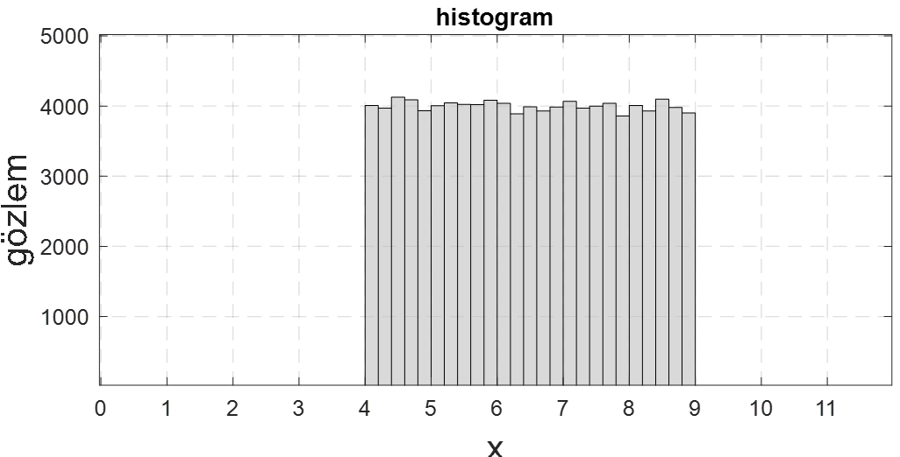

<h3>Tekdüze (Uniform) Dağılım</h3>

<b>Soru:</b>Aşağıda bir dağılıma ait histogram verilmiştir. Aşağıda sorulan soruları histogramı inceleyerek cevaplayınız.

<i>(a)</i> Toplam kaç veri vardır? ($n=100000$)

<i>(b)</i> Bu dağılımın ismi nedir? (Tekdüze (uniform) dağılım).

<i>(c)</i> Dağılımın olasılık yoğunluk fonksiyonunu (pdf) normalize ederek elde ediniz.

<i>(d)</i> Grafikteki veriden veya bir önceki soruda elde ettiğiniz pdf'den faydalanarak

$$P(X \geq 6) = 0.6$$

olduğunu gösteriniz.

<i>(e)</i> Grafikteki veriden veya <i>(c)</i> şıkkında elde ettiğiniz pdf'den faydalanarak

$$P(5 \leq X \leq 8) = 0.6$$

olduğunu gösteriniz.

<i>(f)</i> Bu soruda ismi geçen dağılım daha önceden gördüğümüz

<ul>
    <li>Normal dağılımın $\sigma = 0$ hâline,</li>
    <li>Normal dağılımın $\sigma = \infty$ hâline,</li>
    <li>Üstel dağılımın λ parametresinin 0'a yaklaşırken aldığı hâle,</li>
    <li>Üstel dağılımın λ parametresinin ∞'a yaklaşırken aldığı hâle,</li>
</ul>

benzemektedir. İki şık doğrudur.</a>

<i>(g)</i> Gerçek hayatta zar atma ve bir kişinin tutarsızca söylemlerde bulunması örneklerini düşünerek bu olay/davranış tiplerinin tekdüze dağılımla modellenip modellenemeyeceğiniz düşününüz.
