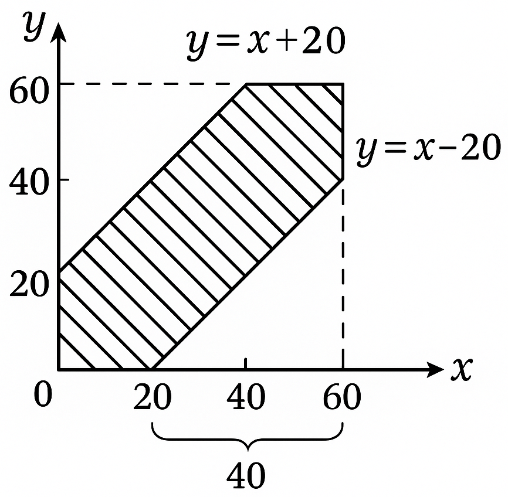

<h3>Hafta 3 Önhazırlık: Buluşma Olasılığı 🫂</h3>

<p align="justify"><b>Soru:</b> Eray ile Safa merkezde buluşmak üzere sözleşiyorlar. Eray'ın telefonu bozulduğu için anlık haberleşemiyorlar. Daha önceden 14:00-15:00 arasında meydanın orada buluşacaklarını ve ilk gelen kişinin 20dk bekleyip eğer öbür taraf gelmezse ayrılacağını konuşmuşlardı. Buluşma olasılıkları nedir?</p>

<p align="justify"><b>Yaklaşım:</b> Her zaman olduğu gibi ilk önce soruya matematiksel (analitik) çözüm geliştirelim. Sonra mümkünse nümerik çözüm olan Monte Carlo Simülasyonu (MCS) metoduyla sonucu teyid etmeye çalışalım. <b>Not:</b> Matematiksel çözümün olmadığı durumlarda MCS'larının değeri çok büyüktür.</p>

<p align="justify"><b>Çözüm 1 (Matematiksel Çözüm):</b> Burada Eray ve Safa 1 saatlik yâni 60dk'lık bir zaman penceresinde rasgele bir anda merkeze geliyorlar. Bu durumda yatay ekseni $X$, dikey ekseni $Y$ rasgele değişkeni olacak şekilde $60 \times 60$'lık bir kare üzerinde analitik geometrik bilgilerimizi kullanarak soruya yaklaşalım.</p>



<p align="justify">Denklemleri oluşturulan doğrular sınır durumlar. Dikkatle incelerseniz bu doğrular üzerindeki noktalarda tam birisi ayrılacakken öbürü geliyor. Biz bu doğruların arasındaki kalan alanın bütün kareye oranı ile ilgileniyoruz. A olayını Eray ile Safa'nın buluşması olarak tanımlarsak</p>

$$
P(A) = \frac{60^2-40^2}{60^2} = \frac{(60-40)(60+40)}{60^2} = \frac{20}{60}\frac{100}{60} = \frac{1}{3}\frac{5}{3} = \frac{5}{9} \approx 0.56
$$

<p align="justify">Yani yaklaşık olarak %56 ihtimalle buluştuklarını buluruz.</p>

<p align="justify"><b>Çözüm 2 (Nümerik Çözüm):</b> Aşağıdaki kod Monte Carlo Simülasyonu'nu gerçeklemektedir.</p>

```
from numpy.random import rand
T = 60 # 1s=60dk'lık bir zaman penceresi
w = 20 # bekleme süresi (dk)
n = 10000 # toplam örnek (sample) sayısı
xy = T*rand(n,2) # n adet rasgele örnek üret
m = sum( abs( xy[:,0] - xy[:,1] ) <= w ) # buluşulan örnek sayısı
print(f"Olasılık (analitik) {((T**2-(T-w)**2)/(T**2)):.5f}")
print(f"Olasılık (nümerik) {m/n:.5f}")
```