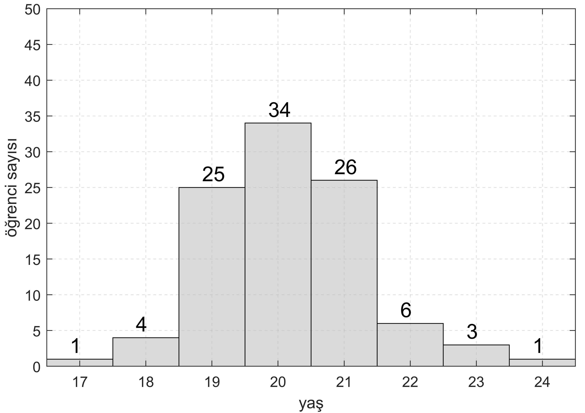

<h3>Hafta 4</h3>
<h4>Histogramlara Giriş, Histogramda (Basit) Koşullu Olasılık</h4>

<b>Soru 7: (Histogram)</b> Bir sınıftaki öğrencilerin yaşları sayıldığında aşağıda verilen histogram ortaya çıkmıştır. Buna göre sınıfta toplam kaç öğrenci vardır? Aşağıda tanımlanan olaylar ve histogramdaki bilgiler ışığında istenilen olasılıkları bulunuz.

$$ \text{A : Seçilen birinin 21 yaşından büyük olması}$$

$$ \text{B : Seçilen birinin 20 yaşına eşit veya küçük olması}$$

$$ \text{C : Seçilen birinin 20 yaşından küçük veya 21 yaşından büyük olması}$$

$$ \text{D : Seçilen birinin 18 yaşında olması}$$

$$ \text{E : Seçilen birinin 20 yaşından küçük olması}$$

$$ \text{F : Seçilen birinin yaşının çift sayı olması}$$

$$P(A)=?$$
$$P(B)=?$$
$$P(C)=?$$
$$P(D)=?$$
$$P(D|E)=?$$
$$P(E|F')=?$$
$$P(D|F)=?$$

<b>Çözüm 7:</b>

$$P(A)=\frac{6+3+1}{100}=\frac{9}{100}=0.09$$
$$P(B)=\frac{34+25+4+1}{100}=\frac{64}{100}=0.64$$
$$P(C)=\frac{(1+4+25)+(6+3+1)}{100}=\frac{40}{100}=0.4$$
$$P(D)=\frac{4}{100}=0.04$$
$$P(D|E)=\frac{4}{1+4+25}=\frac{2}{15} \approx 0.13$$
$$P(E|F')=\frac{1+25}{1+25+26+3}=\frac{26}{55} \approx 0.47$$
$$P(D|F)=\frac{4}{4+34+6+1}=\frac{4}{45} \approx 0.088$$

<b>Soru 8: (Histogramda dağılım)</b> Bursa otogarından İstanbul'a sabah 06:00'dan gece 24:00'a kadar iki saatte bir toplam on sefer var. Bazı seferlerde (yolcu sayısının az olması, otobüsün otogardan çıkış belgelerinin kapıda incelenmesi gibi) çeşitli nedenlerden dolayı otobüsün otogardan ayrılışında gecikmeler olabiliyor. Bu güzergahta çok sık seyahat eden bir yolcu bir hobi projesi olarak otogara bir kamera sistemi kurarak otobüsün otogardan saat başlarında ayrılış vakitlerini (otomatik olarak) yirmi gün boyunca kaydediyor. Bu sürenin sonunda topladığı veriyi çizdirince aşağıdaki histogram grafiğini elde ediyor.

<ul>
<li>Toplam kaç veri vardır? İhtimal hesapları yaparken toplam veri sayısını göz önünde bulundurmayı unutmayınız.</li>
<li>Grafikteki veriye göre yolcu saat başını 4 geçe otogarda olursa ne olasılıkla otobüsü yakalar?</li>
<li>Grafikteki veriye göre yolcu saat başını 2 geçe otogarda olursa ne olasılıkla otobüsü kaçırmıştır?</li>
<li>Belli bir saatte kalkan bir otobüsün otogardan ayrılma vakitleri düşünüldüğünde bu grafikte gözlemlenen <b>dağılım</b> gerçekçi midir? Yorumlayınız.</li>
</ul>

