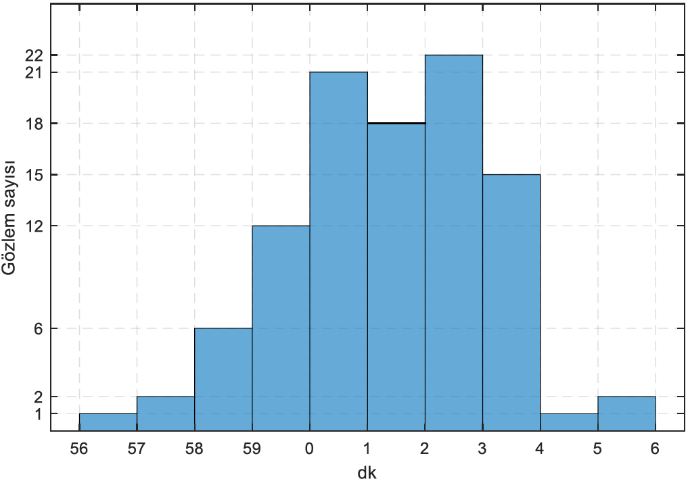

<h3>Hafta 5: Histogramlar (devam), Dağılımlar ve Rasgele Değişkenlere Giriş</h3>

<b>Soru 9 (Histogram - Üstel Dağılım): </b>Trabzon otogarından Gümüşhane'ye her sabah 08:00'de otobüs kalkıyor. Bazı günler (yolcu sayısının az olması gibi) çeşitli nedenlerden dolayı otobüsün kalkışında gecikmeler olabiliyor. Haftada birkaç kez Trabzon'dan Gümüşhane'ye gitmesi gereken bir öğrenci otogara bir kamera sistemi kurarak otobüsün otogardan ayrılış vakitlerini otomatik olarak yüz gün boyunca kaydediyor. Bu sürenin sonunda topladığı veriyi çizdirince aşağıdaki grafiği elde ediyor.

<ul>
<li>Öğrenci otobüsü en az %10 ihtimalle yakalamak isterse <b>en geç</b> saat kaçta otogarda olmalıdır?</li>
<li>Öğrenci otobüsü en az %30 ihtimalle yakalamak isterse <b>en geç</b> saat kaçta otogarda olmalıdır?</li>
<li>Grafikteki veriye göre öğrenci tam saat 8:06'da otogarda olursa hangi olasılıkla otobüse biner?</li>
<li>Grafikteki veriye göre öğrenci tam saat 8:03 ile 08:05 arası otogarda bulunursa hangi olasılıkla otobüse biner?</li>
<li>Histogramda görülen dağılım modellenebilir mi?</li>
<li>Grafikte verilen verileri normalize ederek histogramı tekrar çiziniz. Dağılımın formülünde integral operatörü kullanarak ne mânâya geldiğini anlamaya çalışınız.</li>
</li>
</ul>

<b>Cevap 9:</b>

<ul>
    <li>Öğrenci en geç 08:04'te otogarda olursa (en az) %10 ihtimalle otobüsü yakalar.</li>
    <li>Öğrenci en geç 08:01'te otogarda olursa en az %30 ihtimalle (gerçekte %55 ihtimal) otobüsü yakalar.</li>
    <li>Öğrenci en geç 08:06'da otogarda olursa %2 ihtimalle otobüsü yakalar.</li>
    <li>Öğrenci tam saat 8:03 ile 08:05 arası otogarda bulunursa %13 ihtimalle otobüse biner.</li>
    <li>Evet, üstel (eksponansiyel) dağılım ile modellenir. Formülüze edilmiş hâli aşağıdaki gibidir. Formüldeki X rasgele değişken (random variable) kavramını temsil etmektedir.</li>
</ul>

$$f_X(x) = e^{-\lambda x} \text{ for } x \geq 0$$

<b>Soru 10 (Histogram - Normal Dağılım): </b>Bir öğrenci kaldığı yurttan üniversiteye sabahları 8:00'da dolmuşla gidiyor. Öğrenci bazı günler saat tam 8:00'de ve hatta bazen daha önce bile durakta olmasına rağmen dolmuşu kaçırıyor. Bunun üzerine öğrenci durağa bir kamera sistemi kurarak dolmuşun durağa geliş zamanlarını otomatik olarak 100 gün boyunca kaydediyor. Öğrenci 100 günün sonunda topladığı veriyi çizdirince aşağıdaki grafiği elde ediyor.

<ul>
<li>Buna göre öğrenci dolmuşu en az %75 olasılıkla yakalamak isterse en geç saat kaçta durakta olmalıdır?</li>
<li>Grafikteki veriye göre öğrenci tam saat 8:02'de durakta olursa hangi olasılıkla dersine yetişir?</li>
<li>Histogramda görülen dağılım modellenebilir mi?</li>
<li>Grafikte görselleştirilen veriyi normalize ederek histogramı tekrar çiziniz.</li>
</ul>

<b>Cevap 10: </b>

<ul>
<li>Öğrenci saat 08:00'de durakta olsa %21 ihtimalle dolmuşu kaçıracak. Dolayısıyla %79 ihtimalle dolmuşu yakalar. Eğer 08:01'de durağa giderse %42 ihtimalle kaçırıp %58 ihtimalle yakalayacak. En az %75 ihtimalle yakalamasından bahsedildiği için cevap <b>08:00</b> olur.</li>
<li>(22+15+1+2) / 100 = 40/100 = 0.4</li>
<li>Evet, normal (Gaussian) dağılım olarak formülüze edilebilir.</li>
</ul>

$$f_X(x) = \frac{1}{\sqrt{2\pi\sigma^2}} e^{-\frac{(x - \mu)^2}{2\sigma^2}}$$
