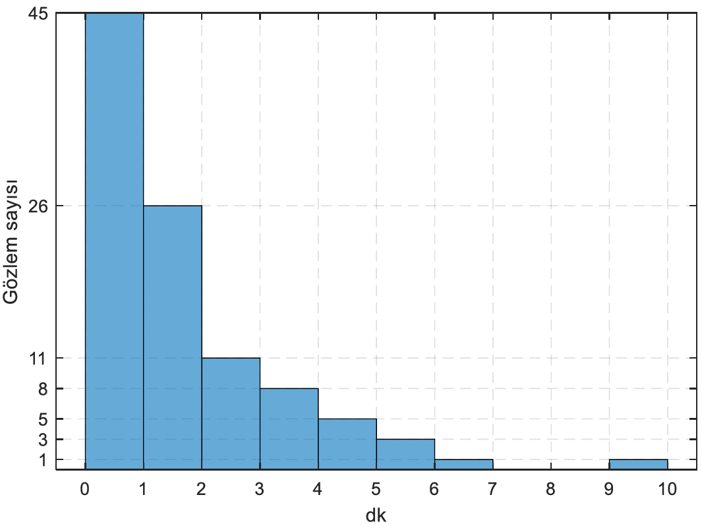

<h3>Hafta 5</h3>
<h4>Histogramlar (devam), Histogramda Koşullu Olasılık, Dağılımlar ve Rasgele Değişkenlere Giriş</h4>

<b>Soru 9: </b>Trabzon otogarından Gümüşhane'ye her sabah 08:00'de otobüs kalkıyor. Bazı günler (yolcu sayısının az olması gibi) çeşitli nedenlerden dolayı otobüsün kalkışında gecikmeler olabiliyor. Haftada birkaç kez Trabzon'dan Gümüşhane'ye gitmesi gereken bir öğrenci otogara bir kamera sistemi kurarak otobüsün otogardan ayrılış vakitlerini otomatik olarak yüz gün boyunca kaydediyor. Bu sürenin sonunda topladığı veriyi çizdirince aşağıdaki grafiği elde ediyor.

<ul>
<li>Öğrenci otobüsü en az %90 ihtimalle yakalamak isterse <b>en geç</b> saat kaçta otogarda olmalıdır?</li>
<li>Öğrenci otobüsü en az %30 ihtimalle yakalamak isterse <b>en geç</b> saat kaçta otogarda olmalıdır?</li>
<li>Grafikteki veriye göre öğrenci tam saat 8:06'da otogarda olursa hangi olasılıkla otobüse biner?</li>
<li>Bu dağılımın ismi nedir? Formülüze edilebilir mi?</li>
</li>
</ul>

<b>Cevap 9:</b>

<ul>
    <li>Öğrenci en geç 08:04'te otogarda olursa (en az) %90 ihtimalle otobüsü yakalar.</li>
    <li>Öğrenci en geç 08:01'te otogarda olursa en az %30 ihtimalle (gerçekte %55 ihtimal) otobüsü yakalar.</li>
    <li>Öğrenci en geç 08:06'da otogarda olursa %2 ihtimalle otobüsü yakalar.</li>
    <li>Üstel (eksponansiyel) dağılım. Formülüze edilmiş hâli aşağıdaki gibidir. Formüldeki X rasgele değişken (random variable) kavramını temsil etmektedir.</li>
</ul>

$$f_X(x) = e^{-\lambda x} \text{ for } x \geq 0$$