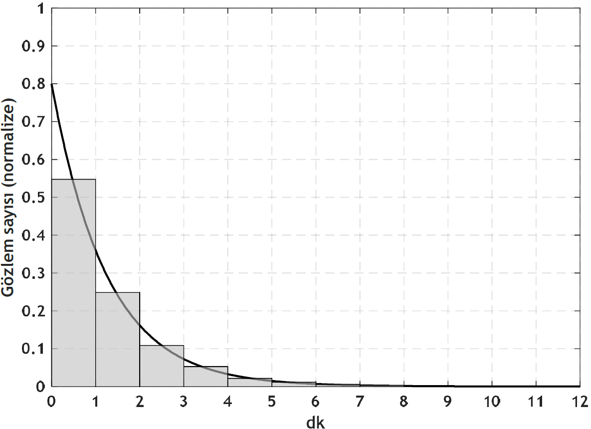

<h3>Üstel (Eksponansiyel) Dağılım Uydurma, Histogramlarda Koşullu/Toplam Olasılık</h3>

<b>Soru 11 (Üstel Dağılım Uydurma): </b>Bir otogardan saat başı ayrılan otobüslerin gecikmelerini dakika dakika gözlemleyen bir araştırmacı toplam <b>n</b> gözlem yaparak aşağıdaki şekilde verilen histogramı oluşturmuştur. <i>(i)</i> Verilenlere göre bu histogramdaki örnek (sample) sayısı <b>n</b> nedir? <i>(ii)</i> Normalize etmeyi açıklayarak histogramı normalize ediniz. <i>(iii)</i> Normalize histogram üzerine bir olasılık yoğunluk fonksiyonu (probability density function - pdf) uydurunuz. <i>(iv)</i> Uydurduğunuz pdf'in parametreleri nelerdir? <i>(v)</i> Yolcu saat başını 3 geçe otogarda olursa otobüsü yakalama olasılığı nedir? Bu soruyu hem histogramdan sayarak hem de elde ettiğiniz dağılım pdf'ini integralleyerek elde ediniz.

<b>Cevap 11:

</b><i>(i)</i> Histogramdaki barların üzerindeki sayıları sayarsak örnek (sample) sayısını <b>n=10000</b> olarak buluruz.

<i>(ii)</i> Histogram barların üzerindeki sayıları <b>n=10000</b>'e bölerek histogramı aşağıdaki gibi normalize ederiz.

<i>(iii)</i> Normalize histogram üzerine uydurulan olasılık yoğunluk fonksiyonunun (probability density function - pdf) grafiği şağıda verilmiştir. <i>(iv)</i> Uydurduğumuz pdf'in parametresi $\lambda$'dır.

$$f_X(x) = \lambda e^{-\lambda x} \text{ for } x \geq 0$$

<i>(v)</i> Yolcu saat başını 3 geçe otogarda olursa otobüsü yakalama olasılığı nedir?

Histogram üzerinde sayım yaparak aşağıdaki çözümü elde ederiz.

$$\frac{527+213+112+56+29+7+5+2+2}{10000} = \frac{953}{10000} = 0.0953$$

Uydurduğumuz pdf üstel dağılımın $\lambda=0.8$ parametresine sahip hâli. Uygun aralığı integralleyerek çözümü ikinci yoldan da bulalım.

$$\int_{x=3}^{\infty} 0.8e^{-0.8x}dx = \int_{x=3}^{\infty} \frac{4}{5} e^{-\frac{4}{5}x}dx = \frac{4}{5}\int_{x=3}^{\infty} e^{-\frac{4}{5}x}dx$$

$$- e^{-0.8x}\Bigg|_{x=3}^{\infty} = -(e^{-\infty}-e^{-2.4}) = e^{-2.4} = 0.09071$$

<b>Soru 12 (Histogramda Koşullu/Toplam Olasılık): </b>Geçen haftaki <a href="https://github.com/mtahakoroglu/probability/tree/main/lecture/week_04">Bursa-İstanbul seferleri histogram sorusu</a>nda otobüslerin otogardan ayrılma saatlerini kaydeden yolcu dikkatli gözlemi sonucunda önemli bir şey farkediyor: Sabah 06:00'dan 10:00'a kadar olan üç seferde otobüslerin otogardan ayrılış vakitleri öğlen 12:00'dan gece 24:00'a kadar olan diğer yedi sefere göre daha az gecikmeli. Bunun sebebini araştırdığında sabah kalkan üç otobüsün geri kalan seferlere göre yolcu
sayısının daha fazla olduğunu, 12:00'dan gece 24:00'e kadar olan seferlerde yolcu sayısı artar diye otobüslerin otogardan vaktinde ayrılmada pek de acele etmediğini gözlemliyor.

Yolcu bu iki farklı durumu farkettikten sonra yine yirmi gün sürecek şekilde yeni veri topluyor. Bu sefer bir önceki soruda olduğu gibi verileri tek bir dağılım olarak çizdirmek yerine iki farklı dağılım
olacak şekilde bunları çizdiriyor: İlk dağılım sabah seferlerine ait iken, ikinci dağılım öğlen 12:00'dan gece 24:00'a kadar olan seferlere ait. Bu bilgilere göre:

<ul>
<li>Yolcu, sabah seferlerinin herhangi birinde otobüs terminalinde saat başını 3 geçe olursa kaç ihtimalle otobüsü yakalar?</li>
<li>Yolcu, öğlen ve gece seferlerinin herhangi birinde otobüs terminalinde saat başını 3 geçe olursa kaç ihtimalle otobüsü yakalar?</li>
<li>Yolcu, sabah-öğle-akşam ayırt edilmeden herhangi bir sefere saat başını 3 geçe otogarda olacak şekilde gelirse, kaç ihtimalle otobüsü yakalar?</li>
</ul>

|       |             |
| :---: |    :---:    |
|  |  |

<b>Cevap 11: </b>Diğer koşullu olasılık ve toplam olasılık sorularında olduğu gibi örneklem uzayı (sample space) S (otobüsün <b>Sabah</b> vakitlerinde ayrılması) ve S' (otobüsün <b>Sabah Hârici</b> (i.e., öğlen-akşam) vakitlerinde ayrılması) olarak iki olaya ayıralım. Ardından Y olayını da 08:03'te otogara gidildiğinde otobüsü <b>Yakalama</b> olarak tanımlarsak aşağıdaki hesaplamaları yapabiliriz.

$$P(Y|S) = \frac{6}{60} = \frac{1}{10}$$

$$P(Y|S') = \frac{38}{140} = \frac{19}{70}$$

$$P(Y) = P(Y|S)P(S) + P(Y|S')P(S')$$

$$P(Y) = \frac{1}{10} \frac{60}{200} + \frac{19}{70} \frac{140}{200}$$

$$P(Y) = \frac{1}{10} \frac{3}{10} + \frac{19}{70} \frac{7}{10}$$

$$P(Y) = \frac{1}{10} \frac{3}{10} + \frac{19}{10} \frac{1}{10}$$

$$P(Y) = \frac{3}{100} + \frac{19}{100}$$

$$P(Y) = \frac{22}{100} = 0.22$$
