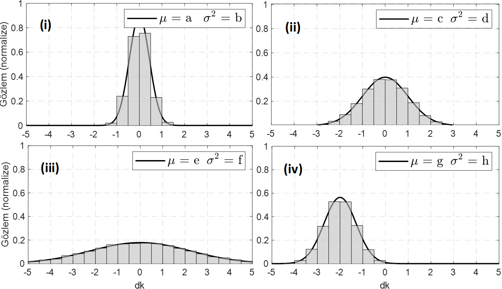

<h3>Hafta 7: Normal (Gaussian) Dağılım Parametreleri, Tekdüze (Uniform) Dağılım</h3>

<b>Soru 12: </b>Aşağıda bir dağılıma ait normalize edilmiş dört histogram verilmiştir. <i>(a)</i> Bu dağılımın ismi nedir? <i>(b)</i> Bu dağılımın parametreleri nelerdir? İsimlerini ve sembollerini yazıp ne manaya geldiklerini açıklayınız. <i>(c)</i> {a, b, c, d, e, f, g, h} değerlerini {0, 0, 0, 0.2, 0.5, 1, 5, -2} değerleriyle eşleyiniz. <i>(d)</i> Sözüne güvenilir ve güvenilmez iki insan var. <i>(i)</i>, <i>(ii)</i>, <i>(iii)</i> ve <i>(iv)</i>'te gösterilen dağılımlarından hangi ikisi bu insanları modelleyemeye uygundur?

<b>Cevap 12:

</b><i>(a)</i> Bu dağılımın ismi Normal (Gaussian) dağılımdır. Dağılıma ait pdf (beşinci hafta derste gördüğümüz şekilde) aşağıdaki gibidir.

$$f_X(x) = \frac{1}{\sqrt{2\pi\sigma^2}} e^{-\frac{(x - \mu)^2}{2\sigma^2}}$$

<i>(b)</i> Normal dağılımın yatay eksende hareket edebilen merkezine ortalama (mean) denilmekte ve $\mu$ sembolüyle gösterilmektedir. Dağılıma ait ikinci parametre standart sapma (standard deviation) denilen ve $\sigma$ sembolüyle gösterilen parametredir. Bu parametrenin ifade ettiği manaya öbür şıklarda değinilecektir.

<i>(c)</i> Parametrelerin değerleri aşağıdaki gibidir. a=c=e=0 g=-2 b=0.2 h=0.5 d=1 f=5

<i>(d)</i> Sözüne güvenilen kişi <i>(i)</i> ile modellenebilir. Güvenilmez olan ise <i>(iii)</i> ile modellenmeye daha uygundur.

<b>Soru 13: </b>Aşağıda bir dağılıma ait histogram verilmiştir. Aşağıda sorulan soruları histogramı inceleyerek cevaplayınız.

<i>(a)</i> Toplam kaç veri vardır?

<b>Cevap 13: </b><i>(a) Toplam <i>(iv)</i> $n=100000$ veri var.

$$P(Y|S) = \frac{6}{60} = \frac{1}{10}$$

$$P(Y|S') = \frac{38}{140} = \frac{19}{70}$$

$$P(Y) = P(Y|S)P(S) + P(Y|S')P(S')$$

$$P(Y) = \frac{1}{10} \frac{60}{200} + \frac{19}{70} \frac{140}{200}$$

$$P(Y) = \frac{1}{10} \frac{3}{10} + \frac{19}{70} \frac{7}{10}$$

$$P(Y) = \frac{1}{10} \frac{3}{10} + \frac{19}{10} \frac{1}{10}$$

$$P(Y) = \frac{3}{100} + \frac{19}{100}$$

$$P(Y) = \frac{22}{100} = 0.22$$
