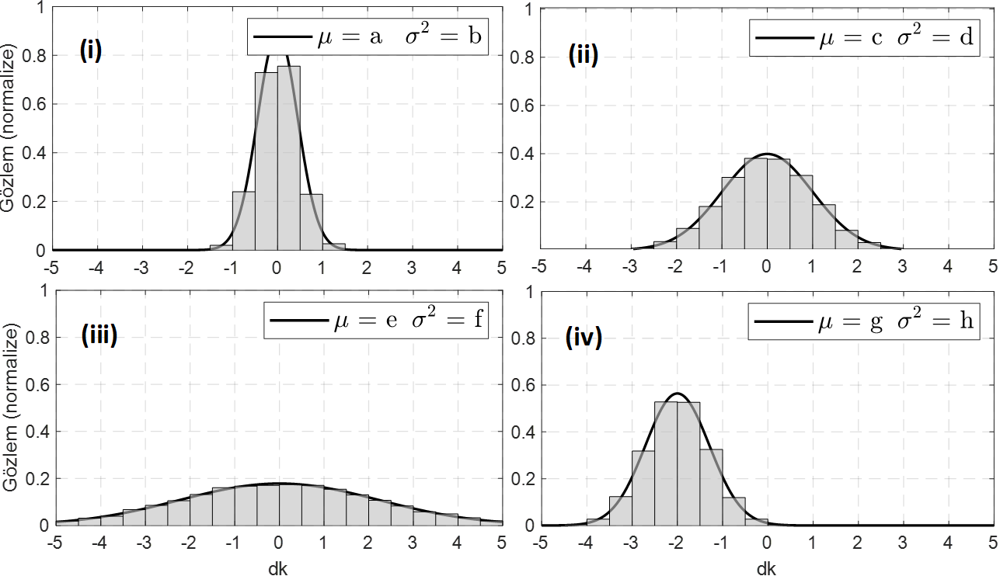
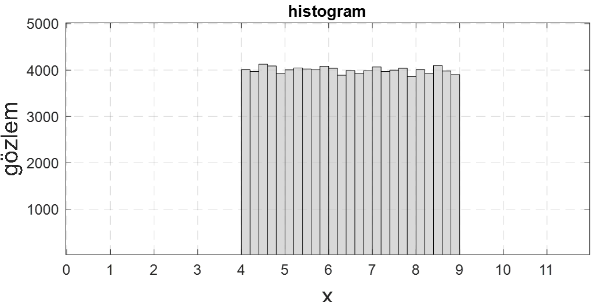

<h3>Normal (Gaussian) Dağılım Parametreleri, Tekdüze (Uniform) Dağılım</h3>

<b>Soru 12: </b>Aşağıda bir dağılıma ait normalize edilmiş dört histogram verilmiştir. <i>(a)</i> Bu dağılımın ismi nedir? <i>(b)</i> Bu dağılımın parametreleri nelerdir? İsimlerini ve sembollerini yazıp ne manaya geldiklerini açıklayınız. <i>(c)</i> {a, b, c, d, e, f, g, h} değerlerini {0, 0, 0, 0.2, 0.5, 1, 5, -2} değerleriyle eşleyiniz. <i>(d)</i> Sözüne güvenilir ve güvenilmez iki insan var. <i>(i)</i>, <i>(ii)</i>, <i>(iii)</i> ve <i>(iv)</i>'te gösterilen dağılımlarından hangi ikisi bu insanları modelleyemeye uygundur?

<b>Cevap 12:

</b><i>(a)</i> Bu dağılımın ismi Normal (Gaussian) dağılımdır. Dağılıma ait pdf (beşinci hafta derste gördüğümüz şekilde) aşağıdaki gibidir.

$$f_X(x) = \frac{1}{\sqrt{2\pi\sigma^2}} e^{-\frac{(x - \mu)^2}{2\sigma^2}}$$

<i>(b)</i> Normal dağılımın yatay eksende hareket edebilen merkezine ortalama (mean) denilmekte ve $\mu$ sembolüyle gösterilmektedir. Dağılıma ait ikinci parametre standart sapma (standard deviation) denilen ve $\sigma$ sembolüyle gösterilen parametredir. Bu parametrenin ifade ettiği manaya öbür şıklarda değinilecektir.

<i>(c)</i> Parametrelerin değerleri aşağıdaki gibidir. a=c=e=0 g=-2 b=0.2 h=0.5 d=1 f=5

<i>(d)</i> Sözüne güvenilen kişi <i>(i)</i> ile modellenebilir. Güvenilmez olan ise <i>(iii)</i> ile modellenmeye daha uygundur.

<b>Soru 13: </b>Aşağıda bir dağılıma ait histogram verilmiştir. Aşağıda sorulan soruları histogramı inceleyerek cevaplayınız.

<i>(a)</i> Toplam kaç veri vardır? ($n=100000$)

<i>(b)</i> Bu dağılımın ismi nedir? (Tekdüze (uniform) dağılım).

<i>(c)</i> Dağılımın olasılık yoğunluk fonksiyonunu (pdf) normalize ederek elde ediniz.

<i>(d)</i> Grafikteki veriden veya bir önceki soruda elde ettiğiniz pdf'den faydalanarak

$$P(X \geq 6) = 0.6$$

olduğunu gösteriniz.

<i>(e)</i> Grafikteki veriden veya <i>(c)</i> şıkkında elde ettiğiniz pdf'den faydalanarak

$$P(5 \leq X \leq 8) = 0.6$$

olduğunu gösteriniz.

<i>(f)</i> Bu soruda ismi geçen dağılım daha önceden gördüğümüz

<ul>
    <li>Normal dağılımın $\sigma = 0$ hâline,</li>
    <li>Normal dağılımın $\sigma = \infty$ hâline,</li>
    <li>Üstel dağılımın λ parametresinin 0'a yaklaşırken aldığı hâle,</li>
    <li>Üstel dağılımın λ parametresinin ∞'a yaklaşırken aldığı hâle,</li>
</ul>

benzemektedir. İki şık doğrudur.</a>

<i>(g)</i> Gerçek hayatta zar atma ve bir kişinin tutarsızca söylemlerde bulunması örneklerini düşünerek bu olay/davranış tiplerinin tekdüze dağılımla modellenip modellenemeyeceğiniz düşününüz.
